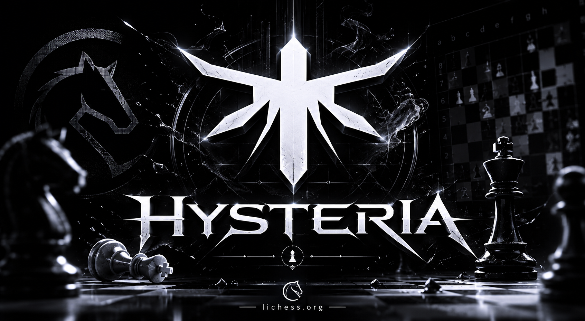
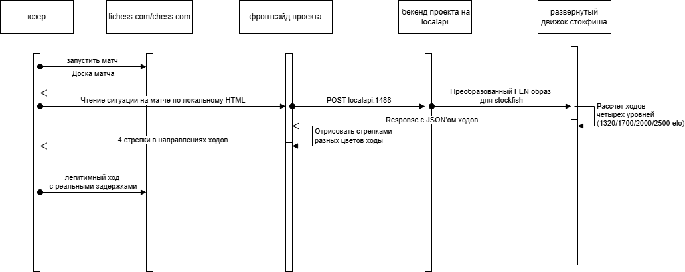

#### Hysteria Lichess.org Cheat
## Стек: // Stack:
Полноценный Fullstack Local софт, не зависящий от внешних API. // Full-featured fullstack local software independent of external APIs.
- **Backend**
    -  *Python3*
        - *Flask* (http сервер) // HTTP server
        - *python-chess* (работа с FEN образами) // working with FEN positions
        - *Stockfish* (сам шахматный движок для принятия решений) // chess engine for move decisions
- **Frontend**
    - **TypeScript**
        - *esbuild* (для сбора .ts -> .js) // bundling .ts -> .js 
        - *DOM parsing* (парсинг позиции на доске) // parsing board position from DOM

## Архитектура // Architecture

// Lichess -> Extension (reads FEN) -> Flask API (port 5267) -> Stockfish -> arrows on board

## Установка // Installation
- Скачайте или клонируйте репозиторий в необходимую вам папку  // Download or clone the repository into the required folder
- Файл движка (stockfish-windows-x86-64.exe) необходимо перенести в любую папку, скопировать ее путь и указать в *./app/server.py* (по дефолту C:/stockfish/stockfish-windows-x86-64.exe)
// Move engine file, copy path, set it in *./app/server.py* (default C:/stockfish/stockfish-windows-x86-64.exe)
- Запустить бекенд // Run backend
```bash
cd {путь}
pip install -r requirements.txt
python app/server.py
```
- Собрать расширение // Build extension
```bash
cd {путь}
npm install
npm run build
```
- в строку сhrome *chrome://extensions* -> Developer mode → Load unpacked → выбрать папку `extension/`.
// In Chrome open chrome://extensions → Developer mode → Load unpacked → select extension/

## Использование // Usage

1. Запустить `python app/server.py` // Start python app/server.py
2. Открыть партию на Lichess.org // Open a game on Lichess.org
3. Расширение автоматически анализирует позицию и рисует стрелки лучших ходов по разным уровням, про них ниже 
// Extension automatically analyzes position and draws best move arrows
4. В меню расширения есть возможность отключить анализ // Analysis can be disabled in extension menu

## Уровни анализа

Расширение отрисовывает 4 уровня хода, которые бекенд успевает просчитать за выделенные *300 мс* // Extension shows 4 move levels computed within ~300 ms
На деле за этот промежуток времени просчет доходит от 12 (тяжелая позиция) до 25 ходов вперед (начало игры/легкая позиция)
// In practice engine calculates ~12–25 plies ahead depending on position
- Уровни
    - 🟢 зелёный - Самый лучший ход по мнению движка Stockfish, самый яркий // green - best Stockfish move, strongest highlight
    - 🟡 оранжевый и 🔵 синий одинаковые по уровню // orange and blue are equal-level moves
    - 🟣 фиолетовый - Худший ход // purple - worst move

## Демонстрация работы // Demo
